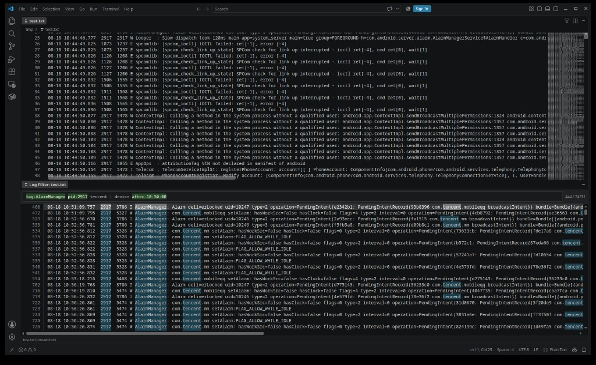

# Log Filter

[English](README.md) | 简体中文

适用于 VS Code 的 Android Studio Logcat 风格日志过滤。运行 **Log Filter: Open**（`Ctrl+Shift+L`）即可在并排 Webview 标签页中使用与 AS 兼容的查询语法进行过滤。

## 功能

- **双标签工作流**：源日志编辑器 + 过滤 Webview 面板并排显示
- **AS Logcat 查询语法**（不含正则 `~` 修饰符）
- **扩展字段**：离线日志支持 `pid:`、`after:`、`before:`
- **虚拟滚动**，适用于大量匹配结果
- **双击 / Enter** 跳转到源文件对应行
- **自动显示** 过滤标签：在已打开文件间切换时自动切到 Filter 标签
- **大文件**：VS Code 能读到编辑器 buffer 时用内存内容（保留未保存修改）；否则从磁盘流式读取；可选大小确认（见设置）

## 用法

1. 点击编辑器标题栏的 **过滤图标**，或按 `Ctrl+Shift+L`
2. 在过滤面板输入查询表达式
3. 双击某一行跳转到源编辑器对应行

## 示例

对大型离线 logcat 导出文件，组合字段键、显式 OR 与时间下界进行过滤：

```
tag:AlarmManager pid:2917 tencent | device after:10:50:00
```



空格分隔的条件按 AND 组合（同一键隐式 OR）。显式 `|` / `&` 为布尔 OR / AND（标准优先级），字段键也可参与 OR（例如 `tag:SurfaceControl | transition`）。匹配行会高亮关键词。

## 查询语法

| 语法 | 含义 |
|------|------|
| `tag:foo` | Tag 包含 `foo` |
| `tag=:foo` | Tag 精确等于 `foo` |
| `-tag:foo` | 排除 Tag 包含 `foo` 的行 |
| `message:text` | Message 包含文本 |
| `line:text` | 完整条目（含续行）包含文本 |
| `level:W` | WARN 及以上级别 |
| `pid:5689` | 进程 ID 匹配 |
| `age:5m` | 距最后一条日志时间戳 5 分钟内 |
| `is:crash` / `is:stacktrace` / `is:firebase` | 预设过滤器 |
| `after:11:02:00` / `before:11:05:00` | 时间上下界 |
| `foo bar` | 完整条目须同时包含两个词（AND） |
| `tag:a tag:b` | 同一键隐式 OR |
| `tag:a -tag:b pid:1` | 含否定时为 AND |
| `tag:foo \| bar` | 显式 OR（字段与文本均可） |
| `(tag:a \| tag:b) & level:E` | 显式分组 |

**不支持：** `package:`（请用 `pid:`）、`tag~:` 正则（会显示警告）。

## 设置

| 设置项 | 默认值 | 说明 |
|--------|--------|------|
| `logFilter.confirmBeforeParseSizeMB` | `0` | 可选：超过此大小（MB）解析前确认，`0` 关闭 |
| `logFilter.parseDebounceMs` | `200` | 日志编辑后重新解析的防抖（ms） |
| `logFilter.queryDebounceMs` | `300` | 查询编辑后重新过滤的防抖（ms） |

解析统一走 Worker 线程；当编辑器 buffer 不可用时（超大日志常见）从磁盘流式读取。文件或查询变更时会丢弃过期的 Worker 结果。

## 开发

```bash
npm install
npm run build
npm test
```

在 VS Code 中按 F5 启动 Extension Development Host。

**要求：** 功能或行为变更后，须在 `test/` 补充/更新测试，并在收工前执行全量 `npm test`。详见 [docs/DEVELOPMENT_CN.md](docs/DEVELOPMENT_CN.md)（[English](docs/DEVELOPMENT.md)）。

## 参考

Android Studio Logcat 过滤器源码（Apache 2.0）已 vendored 至 `reference/as-logcat/`，用于行为对齐参考。

## 许可证

Apache License 2.0。详见 LICENSE 与 NOTICE。
